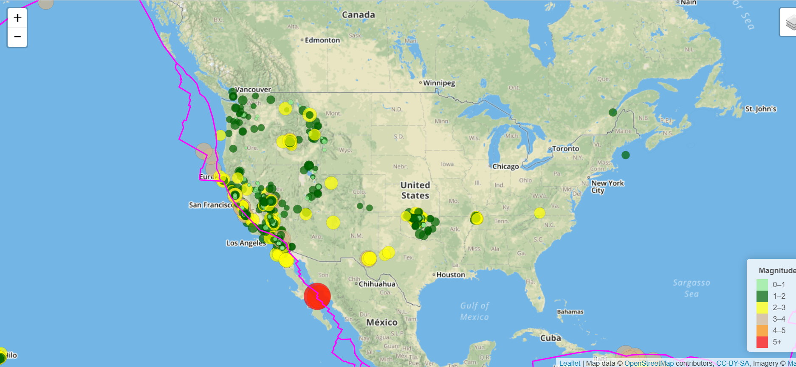

# Leaflet Homework - Visualizing Data with Leaflet

### Project Description

The goal of the project is to display multiple and interactive maps with the location and magnitude of earthquakes around the world. Javascript, HTML, CSS, Bootstrap were used in the project. The Mapbox-API was also used to load the base maps. The project was divided into two steps with different levels of complexity.

### Step 1: Basic Visualization

A single base layer and one set of data were used:
   * Base layer: https://docs.mapbox.com/api/maps/#raster-tiles
   * Data layer Source and Data:
        - Source: https://earthquake.usgs.gov/earthquakes/feed/v1.0/geojson.php (United States Geological Survey (USGS))
        - Data: https://earthquake.usgs.gov/earthquakes/feed/v1.0/summary/all_week.geojson
        
 ### Step 1: More Data

Multiple optional and interactive base layers were included. An additional dataset and plot were included and they can be activated and deactivated by the user.
   * Base layer: 
       - https://docs.mapbox.com/api/maps/#raster-tiles
   * Data layer Source and Data:
       - Source: https://earthquake.usgs.gov/earthquakes/feed/v1.0/geojson.php (United States Geological Survey (USGS))
       - Data: https://earthquake.usgs.gov/earthquakes/feed/v1.0/summary/all_week.geojson

2. **Import & Visualize the Data**

   Create a map using Leaflet that plots all of the earthquakes from your data set based on their longitude and latitude.

   * Your data markers should reflect the magnitude of the earthquake in their size and color. Earthquakes with higher magnitudes should appear larger and darker in color.

   * Include popups that provide additional information about the earthquake when a marker is clicked.

   * Create a legend that will provide context for your map data.

   * Your visualization should look something like the map above.

- - -

### Level 2: More Data (Optional)

The USGS wants you to plot a second data set on your map to illustrate the relationship between tectonic plates and seismic activity. You will need to pull in a second data set and visualize it along side your original set of data. Data on tectonic plates can be found at <https://github.com/fraxen/tectonicplates>.

In this step we are going to..

* Plot a second data set on our map.

* Add a number of base maps to choose from as well as separate out our two different data sets into overlays that can be turned on and off independently.

* Add layer controls to our map.

- - -

### Assessment

Your final product will be assessed on the following metrics:

* Completion of assigned tasks

* Visual appearance

* Professionalism

**Good luck!**

### Copyright

Trilogy Education Services © 2019. All Rights Reserved.
